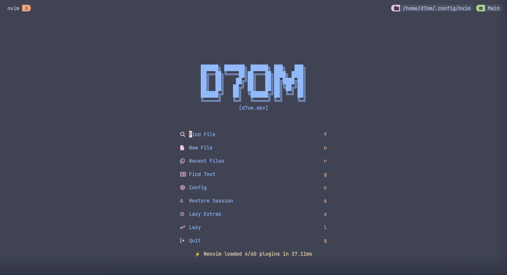

# Neovim Configuration



This repository contains my personal Neovim configuration.

## Keybindings

The configuration uses the [WhichKey](https://github.com/folke/which-key.nvim) plugin for keybinding management.
The `<leader>` key is mapped to `Space`.
Press `Space` to see the available keybindings.

## Installation

To use this configuration, clone this repository to your Neovim configuration directory.

```bash
git clone https://github.com/abdulrahmanDev1/nvim.git ~/.config/nvim
```

Delete the .git folder to use your own repository.

```bash
rm -rf ~/.config/nvim/.git
```

Then, open Neovim and let the magic Happen!.

```bash
nvim
```

Enjoy your Neovim experience!

_This configuration is using LazyVim under the hood._

## Features

- Multi Cursor Support `<leader>m`.
- Spell Checking Support.
- Git Integration using lazygit`<leader>gg` and fugitive.
- Advanced text objects using `nvim-treesitter-textobject`.
- Markdown Preview Command → `:MarkdownPreview`.
