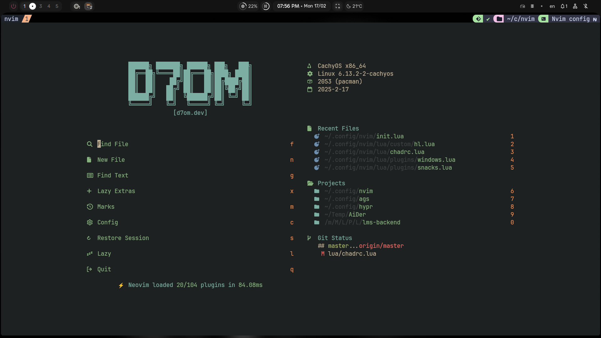

# Neovim Configuration

This repository contains my personal Neovim configuration.




## Installation

To use this configuration, clone this repository to your Neovim configuration directory.

```bash
git clone https://github.com/d7omdev/nvim.git ~/.config/nvim
```

Then, open Neovim and let the magic Happen!.

```bash
nvim
```
